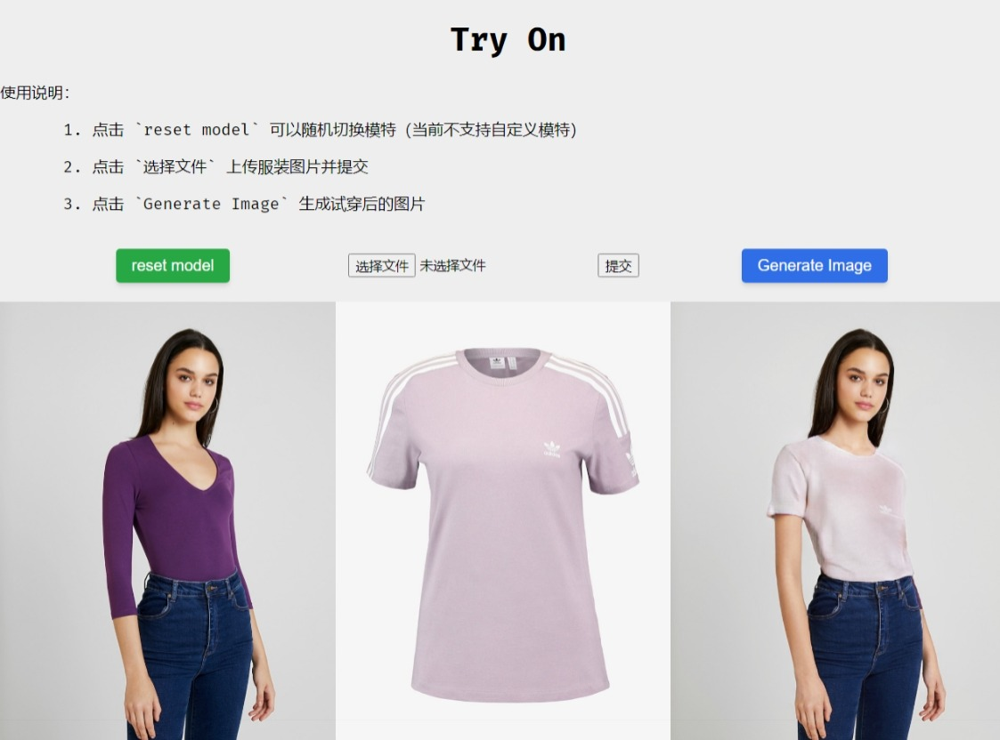
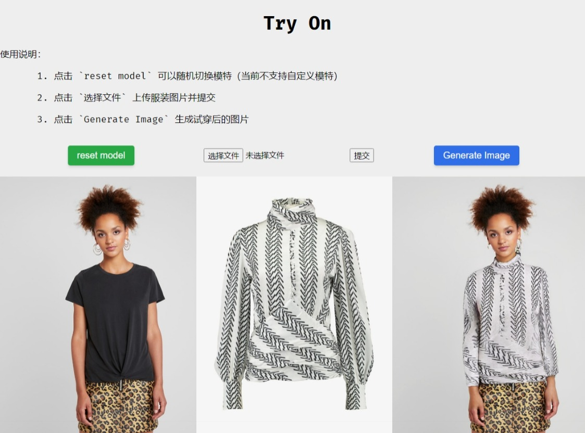

# &#x20; 一个集成在线试穿功能的小型后端

## &#x20;项目简介

* 本项目基于几个 `Python` 深度学习的项目（详见引用部分）以及 [fastapi](https://fastapi.tiangolo.com/) 相关框架
* 由于训练模型数据仅包含上衣，所以当前仅支持试穿上衣
* 当前不支持自定义模特（仅允许随机切换现有模特数据）
* 由于个人开发环境仅有集成显卡，所以涉及 `pytorch` 相关未使用 `cuda`

### &#x20;为什么会有这个项目

前段时间参加一个面试，当时那个面试官希望基于 <https://github.com/sangyun884/HR-VITON> 开发一套服务。由于各种原因最后没有合作，但我利用闲暇时间整理了这个项目。一是最近离职找工作，确实时间相对充沛；二是上一份工作主要做RPA和后端开发，在后端中集成工具也比较实用；三是对深度学习知识了解很少，可以趁机学习一点相关知识。

### &#x20;项目涉及主要内容

* fastapi 框架的基本使用
* opencv、Array、bytes 对象之间的转换
* pytorch 框架相关
* 命令行脚本工具转化为工具类（主要工作）
* 其它待你发现

---

### 展示区

<center>
    
</center>

---

## &#x20;项目环境

目前仅集成试穿上衣，未集成自定义模特，环境相对简单。
*未集成自定义模特的原因见下方 **题外话***

### &#x20;基本环境

* Linux 可选
* python 3.10
* 更多详见 **env.yaml** 和 **requirements.txt**

### &#x20; env.yaml 和 requirements.txt

* env.yaml $\rightarrow$ conda  (指定使用 **tsinghua** 和 **bfsu ，如果下载速度慢可自己更换** )
* requirements.txt $\rightarrow$ pip

分两个依赖是因为 `conda` 和 `pip` 有些包不同。为了避免依赖包冲突，请按下述步骤创建环境并安装依赖（大牛请随意）。
执行下述步骤前，确认已经安装好`conda`环境。将本项目克隆到本地，打开终端并进入到项目根路径。

```bash
# 使用 env.yaml 创建 conda 环境
conda env create -f env.yaml -n tryon

# 切换环境
conda activate tryon

# 安装 cpu 版本 torch 必须指定官方源
pip install torch torchvision torchaudio --index-url https://download.pytorch.org/whl/cpu

# pip 安装其它依赖包
pip install -r requirements.txt

```

*pytorch 及其相关包冲突导致异常比较常见，最好不要使用多个源安装依赖*

## &#x20;项目目录结构

项目实际结构可能有小差异

```bash
.
├── env.yaml                        # conda 项目依赖
├── requirements.txt                 # pip 项目依赖
├── main.py                         # 项目启动脚本
├── README.md
├── routers
│   ├── config.py
│   ├── HR_VITON_main               # HR_VITON 项目
│   │   ├── checkpoints
│   │   ├── cp_dataset.py
│   │   ├── cp_dataset_test.py
│   │   ├── data                    # 数据集路径
│   │   │   └── zalando-hd-resize
│   │   │       └── test
│   │   │           ├── agnostic-v3.2
│   │   │           ├── cloth
│   │   │           ├── cloth-mask
│   │   │           ├── image
│   │   │           ├── image-densepose
│   │   │           ├── image-parse-agnostic-v3.2
│   │   │           ├── image-parse-v3
│   │   │           ├── openpose_img
│   │   │           └── openpose_json
│   │   ├── eval_models
│   │   │   ├── base_model.py
│   │   │   ├── dist_model.py
│   │   │   ├── __init__.py
│   │   │   ├── networks_basic.py
│   │   │   ├── pretrained_networks.py
│   │   │   └── weights             # 模型路径
│   │   │       └── v0.1
│   │   │           ├── gen.pth
│   │   │           └── mtviton.pth
│   │   ├── evaluate.py
│   │   ├── figures
│   │   │   └── fig.jpg
│   │   ├── get_norm_const.py
│   │   ├── get_parse_agnostic.py
│   │   ├── __init__.py
│   │   ├── network_generator.py
│   │   ├── networks.py
│   │   ├── prepare_input.py        # 生成最终图片工具类
│   │   ├── Preprocessing.md
│   │   ├── README.md
│   │   ├── sync_batchnorm
│   │   │   ├── batchnorm.py
│   │   │   ├── batchnorm_reimpl.py
│   │   │   ├── comm.py
│   │   │   ├── __init__.py
│   │   │   ├── replicate.py
│   │   │   └── unittest.py
│   │   ├── test_condition.py
│   │   ├── test_generator.py
│   │   ├── train_condition.py
│   │   ├── train_generator.py
│   │   └── utils.py
│   ├── __init__.py
│   └── tryon_tool
│       ├── get_cloth_mask.py       # 生成 mask 工具类
│       └── __init__.py
├── static
│   ├── current_model.jpg
│   ├── finalimg.png
│   ├── index.js
│   ├── style.css
│   └── tmp.jpg
├── structure.txt
└── templates
    ├── fileUpload_cloth.html
    ├── main.html                   
    └── view.html

```

## 相关下载

数据来源 [VITON-HD](https://github.com/shadow2496/VITON-HD) ，转载仅为提供方便下载，你也可以直接到原项目下载。

* [routers\HR_VITON_main\eval_models\weights\v0.1\gen.pth](https://pan.quark.cn/s/212909e4f89d) $\rightarrow$ 提取码：Emzx
* [routers\HR_VITON_main\eval_models\weights\v0.1\mtviton.pth](https://pan.quark.cn/s/9f6e559d2d5b) $\rightarrow$ 提取码：Lvz3
* [routers\HR_VITON_main\data](https://pan.quark.cn/s/3a319891f200) $\rightarrow$ 提取码：vwVr

## 启动程序

进入项目根目录，打开终端并确认已切换至刚才新创建的 conda 环境，执行 main.py 文件。

```bash
python -c "print('You must be kidding...')" 

```

打开浏览器访问 `http://localhost:8000/Try_On_API/`，尝试上传上衣图片、更换模特、生成试穿图片等操作。由于html页面完全由后端生成，默认情况浏览器可能不会看到刷新后的页面，打开开发者模式，禁用缓存或者使用插件实现禁用缓存。

## &#x20;鸣谢

感谢这些开源项目的作者以及相关贡献者，正是因为他们的奉献和付出才使开源社区发展得如此壮大！（以下排名不分先后）

* [fastapi](https://fastapi.tiangolo.com/) 可能是目前为止最快的几个 python web 框架之一，本项目的后端基于该框架实现
* [HR-VITON](https://github.com/sangyun884/HR-VITON) 本项目主要功能基于该项目实现
* [VITON-HD](https://github.com/shadow2496/VITON-HD) 本项目所使用的模型、数据集来源
* [TryYours-Virtual-Try-On](https://github.com/lastdefiance20/TryYours-Virtual-Try-On) 本项目主要功能基于该项目实现，包括项目结构、实现方案、html页面显示等
* [cloths_segmentation](https://github.com/ternaus/cloths_segmentation) 本项目基于该框架生成上衣 mask 图像
* [Graphonomy](https://github.com/Gaoyiminggithub/Graphonomy)、[Openpose](https://github.com/CMU-Perceptual-Computing-Lab/openpose)、[detectron2](https://github.com/facebookresearch/detectron2) 虽然目前本项目没有集成这些项目作为工具类，但是我在本地测试时分别基于这些项目做了相关功能测试

***如果您发现本项目使用了您开发的工具、框架、数据集等任何而没有提及，还请原谅！请联系我（<blt23@126.com>）并告知相关信息，我会尽快处理。再次感谢！***

## &#x20;题外话

> 选择在 `Linux` 系统下开发，主要是因为 `detectron2` 不支持 `Windows`，如果后续集成相关功能可以减少不必要的麻烦

> 自定义试穿模特（比如使用个人照片）需要做很多额外的工作，正如 [HR-VITON](https://github.com/sangyun884/HR-VITON) 开发者在 [Preprocessing for HR-VITON](https://github.com/sangyun884/HR-VITON/blob/main/Preprocessing.md) 提到的，比如使用 [Openpose](https://github.com/CMU-Perceptual-Computing-Lab/openpose) 生成 `key_points` json 数据（在linux环境下需要自己编译 Openpose）；然后是 `Human Parsing`，原文中基于 [CIHP\_PGN](https://github.com/Engineering-Course/CIHP_PGN) 实现，但是这个项目基于 `tensorflow` 实现的，所以如果你需要集成这个项目，你不得不同时安装两个大型框架，即使它们的功能在某种程度上是一样的。当然，你也可以参考 [TryYours-Virtual-Try-On](https://github.com/lastdefiance20/TryYours-Virtual-Try-On) 开发者的方案，使用 [Graphonomy](https://github.com/Gaoyiminggithub/Graphonomy) 实现 `Human Parsing`，我在测试过程中采用了这个方案，因为 `Graphonomy` 是基于 `pytorch` 实现的；还有接下来基于 [detectron2](https://github.com/facebookresearch/detectron2) 子模块 `densepose` 获取 `Densepose` json数据（`detectron2`可能需要在本地编译安装，取决于 `pytorch` 版本，由于 `2.0` 版本官方未提供预编译包，只能手动编译安装）。除此之外，你需要把这些项目命令行接口封装成工具类，下载项目所需的模型、数据集（在大陆实现这些还是相当麻烦的）

> 测试页面比较简陋，如果你实在无法忍受可以考虑帮我优化一下（给你点赞 :joy:）。试穿的效果可能很多时候也不尽人意，目前爱莫能助。这个小项目还有很多可以优化的地方，比如：
>>
>> * 虽然集成了异步 web 后端框架，但是封装的工具类未采用异步方式
>> * 未采用任务队列，意味着现在不支持多用户并发使用
>> * 未使用 cuda 导致性能较低，生成图片期间 cpu 占用率和内存占用率都会大幅上升
>> * 待补充

> 通过这个项目我有哪些收获：
>>
>> 1. 项目集成是这个项目的主要工作，将命令行脚本封装成工具类。需要解决项目环境、项目依赖、优化模块导入路径，如何尽可能减少重复读写等问题
>> 2. 学习 PIL/OpenCV 处理图片数据，和 Numpy Array、bytes 对象之间的转化
>> 3. 复习 + 学习 fastapi
>> 4. 复习 + 学习 markdown，学习 HTML、CSS 页面布局（虽然简陋但比从上到下强点）
>> 5. 在 github 上创建的首个正式项目

> 如果你对深度学习或者换装项目感兴趣，推荐你了解一下`“鸣谢”`部分提到的相关项目

## 下一步

I am still thinking...
